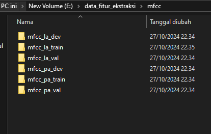

# Langkah-langkah penilitian
1. Konversi dataset dari .flac menjadi .wav
2. Mengubah dataset yang sudah dikonversi menjadi bentuk gambar dalam bentuk diagram spectral
3. Pembuatan model
4. (bersambung)

# Library Yang dipakai
1. `ffmpeg`
2. `subproccess`
3. `librosa`
4. `keras`
5. `tensorflow`
6. `Os`

# Catatan
1. Pastikan dataset ASVspoof2019 sudah diunduh dan ektraksi
2. karena saya masih tahap konversi dan kebetulan belum selesai, saya ambil contoh pada `pa_dev_dataset`.

## 1. Konversi dataset dari .flac menjadi .wav

Siapkan folder baru untuk menyimpan hasil konversi seperti gambar atas.
______________________________________________________________________

buka folder `data_model`, lalu buka file `pa_dev_dataset`
_______________________________________________________________________

Pada bagian `input_file` dan `output_file`, ubah sesuai tempat penyimpanan masing-masing. `input_file` sebagai penyimpanan dataset `pa_dev_dataset` dan `output_file` sebagai tempat hasil konversi.

begitu terus hingga file la atau (Logis Attack).

## 2. Mengubah dataset yang sudah dikonversi menjadi bentuk gambar dalam bentuk diagram spectral
__________________________________________________________________________

Buat folder seperti gambar diatas. Untuk letak folder bebas ditaruh dimana.
_________________________________________________________________________

Didalam folder tersebut, buat folder baru seperti gambar diatas

*Penjelasan: 14 folder tersebut merupakan fitur ektraksi librosa, penilitian ini akan membandingkan semua fitur dan akan diliat akurasinya, lalu digunakan pada implementasi sistem.

Setiap folder fitur ektraksi terdapat enam folder tambahan guna menyimpan dataset. Seperti gambar diatas.
__________________________________________________________________________
